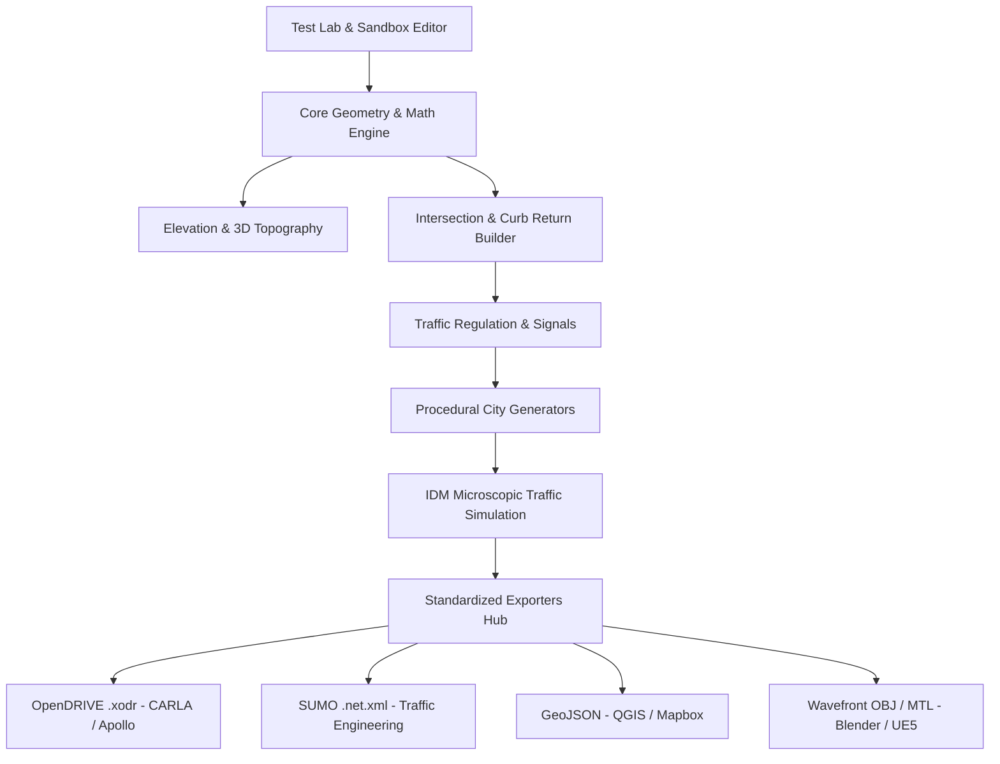

# 🛣️ Road World Engine 3D

> **Moteur de Voirie Paramétrique 3D, Générateur Urbain Procédural & Simulateur de Trafic Microscopique Autonome (IDM).**  
> *Conforme aux standards de l'industrie : ASAM OpenDRIVE, Eclipse SUMO, GeoJSON GIS et Wavefront OBJ 3D.*

---

## 🌟 Vue d'ensemble du Projet

**Road World Engine** est un moteur de simulation et de génération de voirie développé en TypeScript / Three.js. Il résout l'ensemble des défis géométriques, topologiques, réglementaires et physiques nécessaires pour modéliser des réseaux routiers réalistes en 3D avec circulation autonome multi-agents.



---

## 📚 Feuille de Route & Historique des Versions (V0.1 à V1.0)

| Version | Nom / Thématique | Fonctionnalités Clés |
| :--- | :--- | :--- |
| **V0.1** | **Base Geometry & TestLab** | Courbes paramétriques (Lignes, Béziers cubiques, Arcs), profils de voirie, maillage asphalte et banc d'essai de 10 scénarios. |
| **V0.2** | **Intersections & Curb Returns** | Congés de trottoir continus $G^1$, îlots séparateurs triangulaires pour giratoires, carrefours en T, X et asymétriques. |
| **V0.3** | **Road Markings & 3D Extrusions** | Passages piétons zébrés, flèches directionnelles, lignes d'arrêt, décalages Bézier précis, anneau de giratoire 3D. |
| **V0.4** | **Traffic Regulation & Badges** | Arbitrage des priorités (Priorité à droite, STOP, Cédez-le-passage, Giratoire), détection des conflits de trajectoire. |
| **V0.5** | **Dynamic Traffic Lights** | Contrôleurs de feux tricolores à machines à états, cycles Vert/Jaune/Tous-Rouges, mâts et potences 3D orientés. |
| **V0.6** | **Elevation & 3D Topography** | Profils en long $Z(s)$, viaducs surélevés étagés, dévers automatique $q = \frac{V^2}{127R}$ et dévers en toit ($-2.5\%$). |
| **V0.7** | **Procedural City Generation** | Générateurs procéduraux déterministes (PRNG Mulberry32) : Grille Manhattan, Ville Organique et Réseau Radial-Concentrique. |
| **V0.8** | **Microscopic Autonomous Traffic** | Simulation de trafic IDM (*Intelligent Driver Model*), feux stop temps réel, anti-collision physique et respect de l'anneau. |
| **V0.9** | **Standardized Exporters Hub** | Exportateurs industriels en 1 clic : ASAM OpenDRIVE (`.xodr`), Eclipse SUMO (`.net.xml`), GeoJSON GIS et OBJ 3D. |
| **V1.0** | **Production Release & Sandbox** | Mode Éditeur Interactif Sandbox (pose de routes au clic), métropole démo `TEST-19` et optimisation 60 FPS. |

---

## 📐 Fondations Mathématiques & Algorithmiques

### 1. Modèle de Poursuite IDM (*Intelligent Driver Model*)
L'accélération longitudinale $a$ de chaque véhicule est calculée en temps réel selon :
$$a = a_{\max} \left[ 1 - \left(\frac{v}{v_0}\right)^\delta - \left(\frac{s^*(v, \Delta v)}{s}\right)^2 \right]$$
Avec distance de sécurité dynamique :
$$s^*(v, \Delta v) = s_0 + \max\left(0, v \cdot T + \frac{v \cdot \Delta v}{2\sqrt{a_{\max} \cdot b}}\right)$$

### 2. Dévers Automatique en Virage (Superelevation)
Pour compenser l'accélération centrifuge dans les virages de rayon $R$ parcourus à vitesse $V$ :
$$q = \min\left(0.07, \frac{V^2}{127 \cdot R}\right)$$

---

## 🚀 Démarrage Rapide

### Prérequis
- **Node.js** (v18+)
- **npm**

### Installation & Lancement
```bash
# 1. Cloner le dépôt
git clone https://github.com/dayhz/Koth3.git
cd Koth3

# 2. Installer les dépendances
npm install

# 3. Lancer le serveur de développement
npm run dev
```

Ouvrez ensuite votre navigateur sur **`http://localhost:3001/`** pour accéder au TestLab interactif.

### Exécuter les Tests Unitaires & Intégration
```bash
# Lancer l'ensemble des 59 tests automatisés
npm test

# Compiler pour la production
npm run build
```

---

## 📦 Formats d'Exportation Supportés

- **🚗 ASAM OpenDRIVE (`.xodr`)** : Compatible CARLA, Apollo, BeamNG.drive.
- **🚦 Eclipse SUMO Network (`.net.xml`)** : Compatible SUMO GUI / TraCI.
- **🗺️ GeoJSON GIS (`.geojson`)** : Compatible QGIS, ArcGIS, Mapbox, Leaflet.
- **🎨 Wavefront 3D (`.obj` + `.mtl`)** : Compatible Blender, Unreal Engine 5, Unity.
- **💾 JSON Natif (`.json`)** : Sauvegarde et rechargement complet sans perte du graphe routier.

---

## 📄 Licence

Ce projet est sous licence open source MIT.
